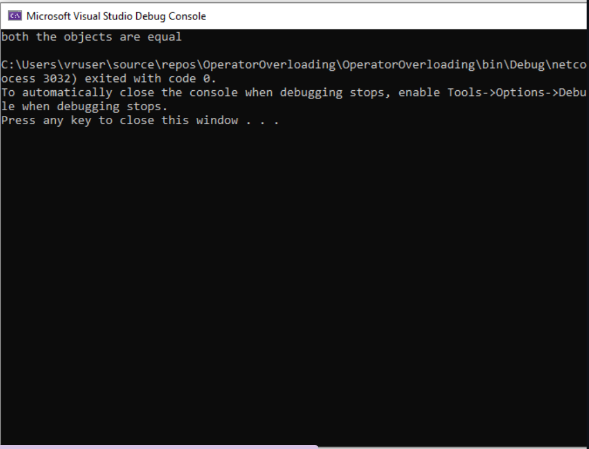

### EX NO : 06
### DATE  : 
# <p align="center">Operator-Overloading</p>


## Aim:
To write a C# program to pass values through constructors(default and parameterized) and also overload equal operators by checking whether objects are equal using operator overloading. 
 
## Algorithm:
### Step1:
Create a class for operator overloading.
### Step2:
Values are passed through constructors.
### Step3:
After that return the bool operator.
### Step4:
Then create a new object to store the return object.
### Step5:
After that print the calculated volume.
 
 
 ## Program:
 NAME:- EZHIL MATHI.R

 
 REG NO:- 212221230026

 ```c#
 using System;

namespace OperatorOverloading
{
    class program
    {
        public static bool operator ==(program p1, program p2)
        {
            return p1.Equals(p2);
        }
        /*public static bool operator ==(program p3, program p4)
        {
            return p3.Equals(p4);
        }*/

        public static bool operator !=(program p1, program p2)
        {
            return !(p1 == p2);
            //return !(p3 == p4);
        }

        public int p1,p2;
        public program()
        {
            p1 = 45;
            p2 =15;
        }

        public program(int p3, int p4)
        {
            p1 = p3;
            p2 = p4;
        }
        public static void Main()
        {
            program p1 = new program();
            program p2 = p1;

            if (p1 == p2)
            {
               
                Console.WriteLine("both the objects are equal");
            }

            else if (p1 != p2)
            {
                Console.WriteLine("both the objects are not equal");
            }
        }
    }
}


 ```

 
 ## Output:


 
 ## Result:
C# program to find the volume of a box using operator overloading is implemented successfully.
